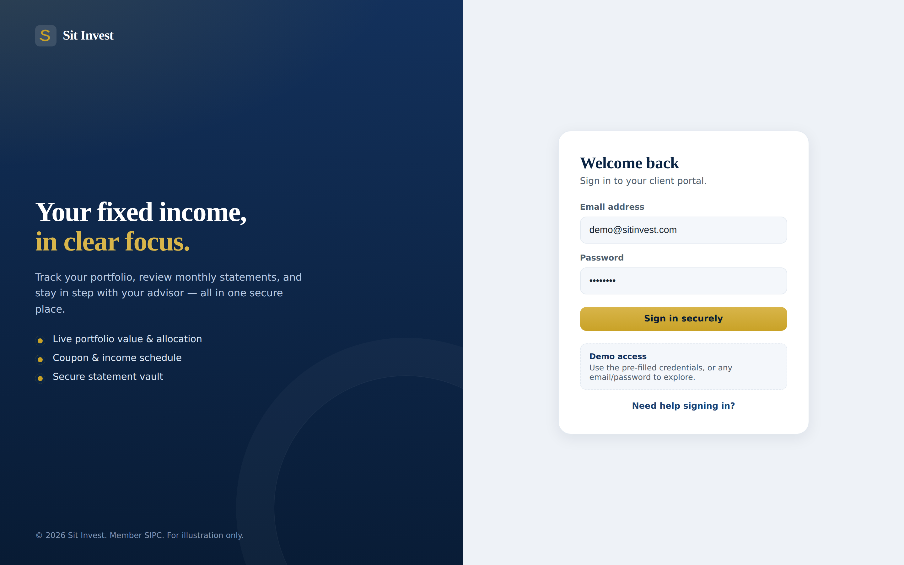
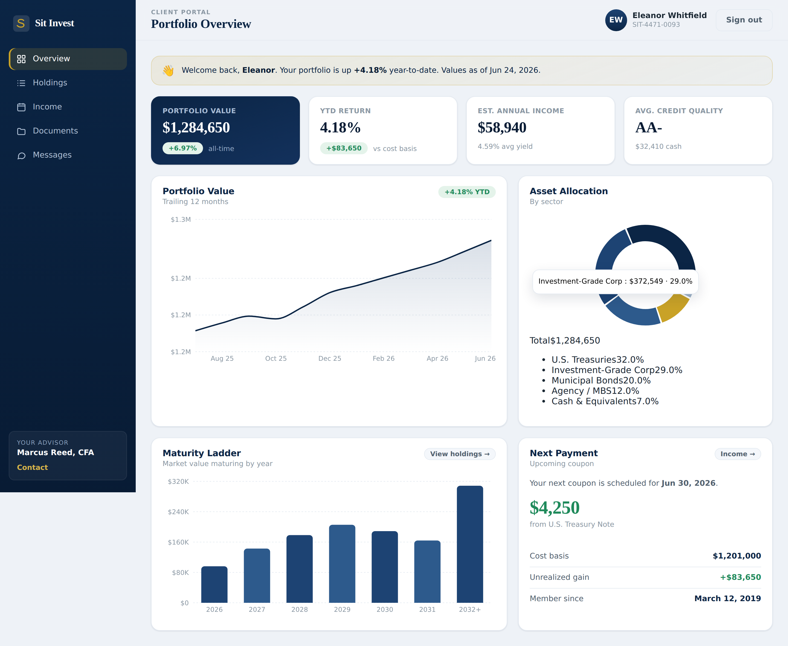
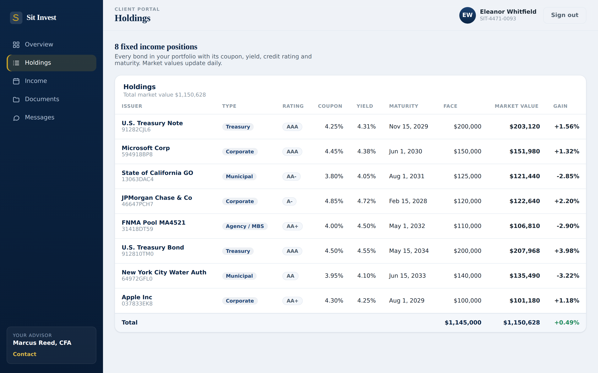
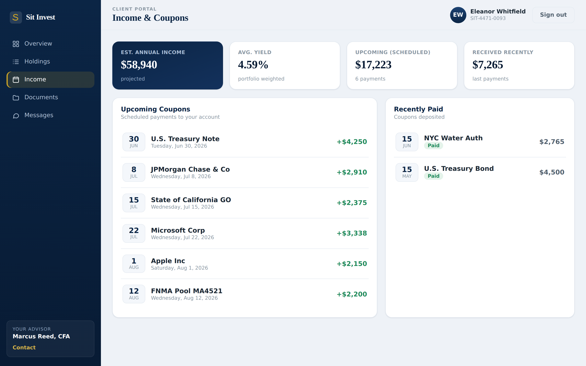
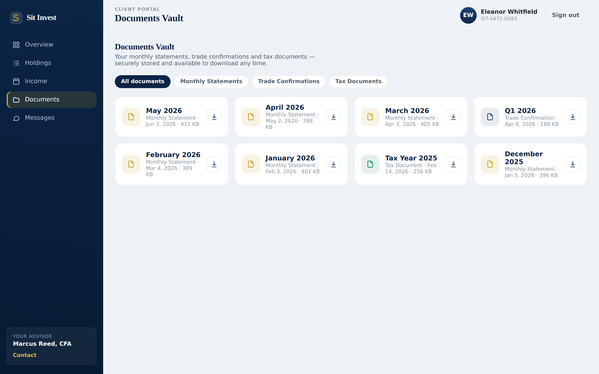
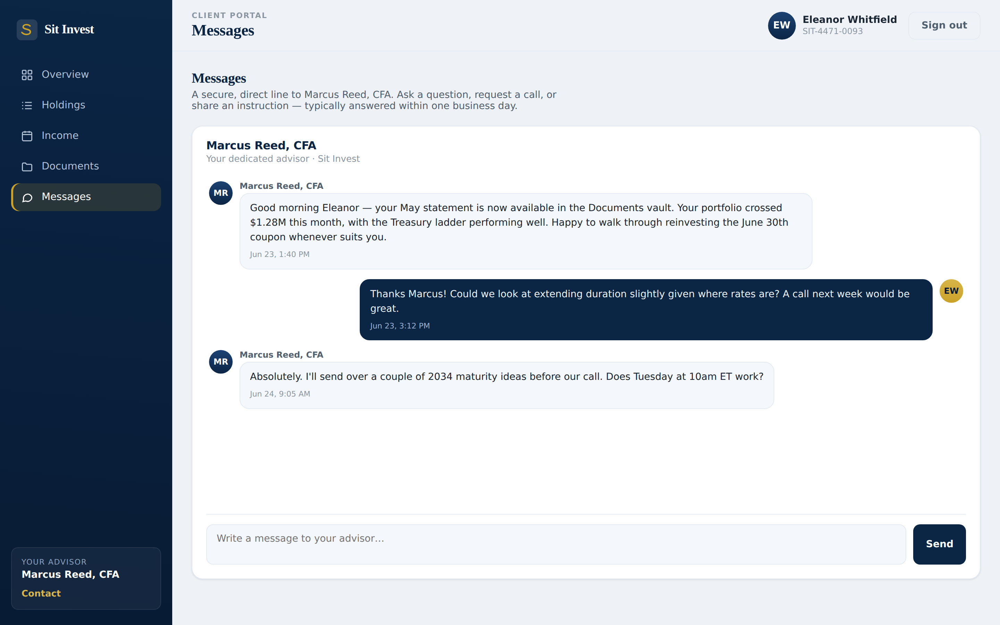

# Sit Invest — Client Portal

A friendly, secure client portal for **Sit Invest**, a fixed income firm. Clients
sign in to see their portfolio at a glance, explore holdings, track coupon income,
download monthly statements, and message their advisor.

> **Status:** Working frontend prototype with realistic mock data, plus a ready-to-wire
> backend for your **Microsoft SQL Server** database (the one you manage in SSMS).


---

## ✨ Features

| Area | What clients get |
| --- | --- |
| **Secure login** | Branded sign-in with session persistence (demo credentials pre-filled) |
| **Portfolio overview** | Total value, YTD return, est. income, credit quality at a glance |
| **Value chart** | 12-month portfolio value area chart |
| **Allocation pie** | Donut chart of allocation by sector (Treasuries, Corp, Muni, Agency, Cash) |
| **Maturity ladder** | Bar chart of market value maturing by year — key for fixed income |
| **Holdings table** | Every bond: issuer, coupon, yield, rating, maturity, value, gain |
| **Income & coupons** | Upcoming and recently-paid coupon calendar with projected income |
| **Documents vault** | Monthly statements, trade confirmations & tax docs — filter and download |
| **Messages** | Secure direct line to the client's advisor |
| **Responsive** | Works on desktop, tablet and mobile |

Design: a conservative **navy & gold** "trust" theme fitting a fixed income firm.

---

## 📸 Screenshots

| Login | Dashboard |
| --- | --- |
|  |  |

| Holdings | Income & Coupons |
| --- | --- |
|  |  |

| Documents Vault | Messages |
| --- | --- |
|  |  |

Regenerate these any time with the dev server running:

```bash
npm run dev          # terminal 1
npm run screenshots  # terminal 2 — writes to screenshots/
```

---

## 🚀 Quick start (prototype)

```bash
npm install
npm run dev
```

Open http://localhost:5173 and sign in — the demo credentials are pre-filled
(`demo@sitinvest.com` / `demo1234`), or use any email/password to explore.

Build for production:

```bash
npm run build && npm run preview
```

The prototype uses the sample data in [`src/data/mockData.ts`](src/data/mockData.ts);
no backend or database is required to click through everything.

---

## 🗄️ Connecting your SQL Server database

The whole app talks to the data source through **one seam**:
[`src/services/api.ts`](src/services/api.ts). Today it returns mock data. Point it at
your database and every screen loads live data — no UI changes needed, because the
backend returns the same shapes defined in [`src/data/types.ts`](src/data/types.ts).

A browser must never connect to a database directly (it would expose your
credentials), so there is a small backend in [`server/`](server/) that connects to
SQL Server and exposes a REST API.

### 1. Configure & run the backend

```bash
cd server
npm install
cp .env.example .env        # then fill in your SQL Server details
npm run dev                 # starts the API on http://localhost:4000
```

`.env` holds your SQL Server host, database, login and a JWT secret — see
[`server/.env.example`](server/.env.example). Credentials live here, never in the
frontend.

### 2. Map the queries to your tables

[`server/index.js`](server/index.js) contains the API routes with example T-SQL.
Search for `TODO: schema` and adjust the table/column names to match your database.
[`server/schema.reference.sql`](server/schema.reference.sql) shows the exact shape
each query expects — use it as a guide, or run it in SSMS to start from a clean schema.

> Auth note: the login route includes a placeholder check. Before going live, verify
> the password against a stored **hash** (bcrypt/argon2) — never plaintext.

### 3. Point the frontend at the API

```bash
# in the project root
cp .env.example .env
# uncomment / set:
VITE_API_BASE_URL=http://localhost:4000/api
```

Restart `npm run dev`. The app now reads live data from SQL Server. (When
`VITE_API_BASE_URL` is unset, it automatically falls back to mock mode.)

---

## 🧱 Tech stack

- **React 18 + TypeScript + Vite** — fast, typed frontend
- **React Router** — login / dashboard routing with an auth guard
- **Recharts** — area, donut and bar charts
- **Express + `mssql`** — backend API connecting to Microsoft SQL Server
- Plain CSS with a small design-token system (no UI framework) for full control

## 📁 Project structure

```
src/
  components/      layout, charts, reusable UI (Card, StatCard…)
  context/         AuthContext (login/logout, session)
  data/            types.ts (API contract) + mockData.ts (sample data)
  hooks/           useAsync data-fetching helper
  pages/           Login, Dashboard, Holdings, Income, Documents, Messages
  services/        api.ts  ← the swappable data seam (mock ↔ real backend)
  utils/           currency/date formatters
server/            Express API + SQL Server connection + reference schema
```

---

## 🔒 Security notes for production

- Serve over HTTPS; set a strong `JWT_SECRET` and short token expiry.
- Use a **least-privilege** SQL login for the app (read-mostly).
- Always compare passwords against a hash; consider MFA for client logins.
- Statements should stream from secured storage with per-client authorization checks.

---

_Sample figures and clients are illustrative. © Sit Invest._
